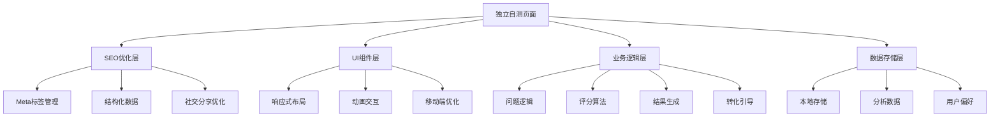
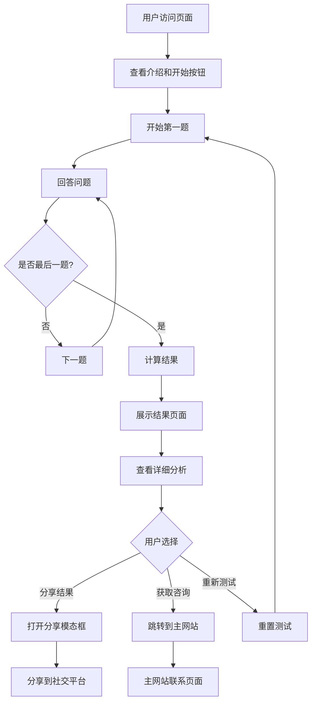

# 设计文档

## 概述

本设计文档描述了如何将现有的媒体AI成熟度5分钟自测构建为一个独立的、可分享的网站页面。该独立页面将基于现有的React组件架构，但进行重新设计以优化用户体验、提升转化率，并支持独立部署和分享。

设计的核心目标是创建一个专业、易用、高转化的独立自测工具，既能独立运行又能有效引导用户到主网站获取更多服务。

## 架构

### 整体架构



### 技术架构

- **前端框架**: React 18 (与现有项目保持一致)
- **样式系统**: Tailwind CSS + 自定义CSS变量
- **构建工具**: 基于现有的Babel转译方案
- **部署方式**: 静态HTML页面，可独立部署
- **数据存储**: localStorage (客户端存储)
- **分析工具**: Google Analytics 4 集成

### 文件结构

```
ai-maturity-standalone/
├── index.html                 # 独立页面入口
├── components/
│   ├── StandaloneAssessment.js    # 主评估组件
│   ├── SEOHead.js                 # SEO优化组件
│   ├── ShareModal.js              # 分享功能组件
│   ├── ResultsDisplay.js          # 结果展示组件
│   └── ConversionCTA.js           # 转化引导组件
├── assets/
│   ├── styles.css             # 独立样式文件
│   └── images/                # 图片资源
└── utils/
    ├── analytics.js           # 分析工具
    ├── sharing.js             # 分享功能
    └── storage.js             # 数据存储
```

## 组件和接口

### 1. StandaloneAssessment 主组件

**职责**: 管理整个自测流程的状态和逻辑

**接口**:
```javascript
interface StandaloneAssessmentProps {
  // 无外部props，完全独立运行
}

interface StandaloneAssessmentState {
  currentQuestion: number;
  answers: Record<string, number>;
  showResult: boolean;
  result: AssessmentResult | null;
  isLoading: boolean;
}
```

**主要方法**:
- `handleAnswer(questionId: string, value: number)`: 处理用户答案
- `nextQuestion()`: 进入下一题
- `prevQuestion()`: 返回上一题
- `calculateResult()`: 计算评估结果
- `restartAssessment()`: 重新开始测试
- `trackEvent(eventName: string, data: object)`: 跟踪用户行为

### 2. SEOHead 组件

**职责**: 管理页面的SEO元数据和社交分享优化

**接口**:
```javascript
interface SEOHeadProps {
  title?: string;
  description?: string;
  keywords?: string;
  ogImage?: string;
  canonicalUrl?: string;
}
```

**功能**:
- 动态设置页面标题和描述
- 配置Open Graph和Twitter Card
- 添加结构化数据标记
- 设置canonical URL

### 3. ShareModal 组件

**职责**: 提供结果分享功能

**接口**:
```javascript
interface ShareModalProps {
  isOpen: boolean;
  onClose: () => void;
  result: AssessmentResult;
  shareUrl: string;
}
```

**功能**:
- 生成分享文案
- 支持微信、微博、QQ等平台分享
- 复制链接功能
- 生成分享图片

### 4. ResultsDisplay 组件

**职责**: 展示评估结果和个性化建议

**接口**:
```javascript
interface ResultsDisplayProps {
  result: AssessmentResult;
  onRestart: () => void;
  onShare: () => void;
  onConsult: () => void;
}
```

**功能**:
- 可视化展示评估等级
- 显示详细分析和建议
- 提供行动方案
- 集成转化引导

### 5. ConversionCTA 组件

**职责**: 引导用户转化到主网站

**接口**:
```javascript
interface ConversionCTAProps {
  result: AssessmentResult;
  variant: 'primary' | 'secondary';
}
```

**功能**:
- 根据评估结果个性化CTA文案
- 跟踪转化点击
- 引导到主网站相关页面
- A/B测试支持

## 数据模型

### AssessmentResult 数据模型

```javascript
interface AssessmentResult {
  level: 'L1' | 'L2' | 'L3' | 'L4' | 'L5';
  levelName: string;
  description: string;
  recommendations: string[];
  score: number;
  answers: Record<string, number>;
  completedAt: Date;
  dimensions: DimensionScore[];
}

interface DimensionScore {
  dimension: string;
  score: number;
  level: string;
  feedback: string;
}
```

### Question 数据模型

```javascript
interface Question {
  id: string;
  dimension: string;
  question: string;
  options: QuestionOption[];
  weight?: number; // 问题权重，用于个性化评分
}

interface QuestionOption {
  value: number;
  text: string;
  level: string;
  description?: string; // 选项详细说明
}
```

### UserSession 数据模型

```javascript
interface UserSession {
  sessionId: string;
  startTime: Date;
  currentQuestion: number;
  answers: Record<string, number>;
  source?: string; // 来源渠道
  device: 'mobile' | 'tablet' | 'desktop';
}
```

## 错误处理

### 错误类型定义

```javascript
enum ErrorType {
  NETWORK_ERROR = 'NETWORK_ERROR',
  VALIDATION_ERROR = 'VALIDATION_ERROR',
  STORAGE_ERROR = 'STORAGE_ERROR',
  ANALYTICS_ERROR = 'ANALYTICS_ERROR'
}

interface AppError {
  type: ErrorType;
  message: string;
  details?: any;
  timestamp: Date;
}
```

### 错误处理策略

1. **网络错误**: 提供离线模式，本地计算结果
2. **存储错误**: 降级到内存存储，提示用户
3. **分析错误**: 静默失败，不影响核心功能
4. **验证错误**: 友好提示，引导用户修正

### 错误边界组件

```javascript
class StandaloneErrorBoundary extends React.Component {
  // 专门为独立页面设计的错误边界
  // 提供更友好的错误恢复机制
}
```

## 测试策略

### 单元测试

- **组件测试**: 使用React Testing Library测试所有组件
- **逻辑测试**: 测试评分算法和数据处理逻辑
- **工具函数测试**: 测试分享、存储等工具函数

### 集成测试

- **用户流程测试**: 完整的自测流程端到端测试
- **跨浏览器测试**: 确保在主流浏览器中正常运行
- **响应式测试**: 测试不同屏幕尺寸下的表现

### 性能测试

- **加载性能**: 首屏渲染时间 < 3秒
- **交互性能**: 问题切换响应时间 < 200ms
- **内存使用**: 长时间使用不出现内存泄漏

### A/B测试

- **CTA文案测试**: 测试不同转化文案的效果
- **结果展示测试**: 测试不同结果展示方式的用户反馈
- **分享功能测试**: 测试分享功能的使用率

## UI/UX 设计规范

### 设计原则

1. **简洁明了**: 减少认知负担，突出核心功能
2. **专业可信**: 体现专业性，建立用户信任
3. **移动优先**: 优先考虑移动端体验
4. **转化导向**: 每个设计决策都考虑转化目标

### 视觉设计

#### 色彩方案
- **主色**: #003366 (深蓝色，专业稳重)
- **辅助色**: #D4AF37 (金色，突出重点)
- **成功色**: #00C292 (绿色，积极反馈)
- **背景色**: 渐变背景，增加视觉层次

#### 字体规范
- **标题**: 24px-32px, 粗体
- **正文**: 16px-18px, 常规
- **说明**: 14px, 浅色
- **按钮**: 16px, 中等粗细

#### 间距系统
- **组件间距**: 24px, 32px, 48px
- **内容间距**: 16px, 20px
- **按钮内边距**: 12px 24px

### 交互设计

#### 动画效果
- **页面切换**: 300ms 缓动动画
- **按钮反馈**: 150ms 缩放效果
- **进度条**: 流畅的进度更新动画
- **结果展示**: 渐入动画，增加仪式感

#### 响应式断点
- **移动端**: < 768px
- **平板**: 768px - 1024px
- **桌面**: > 1024px

#### 可访问性
- **键盘导航**: 支持Tab键导航
- **屏幕阅读器**: 提供适当的ARIA标签
- **对比度**: 确保文字对比度符合WCAG标准
- **字体大小**: 支持用户缩放

### 用户体验流程



## 性能优化

### 加载优化
- **代码分割**: 按需加载非关键组件
- **资源压缩**: 压缩CSS和JavaScript文件
- **图片优化**: 使用WebP格式，提供多尺寸版本
- **CDN加速**: 静态资源使用CDN分发

### 运行时优化
- **虚拟化**: 大量选项时使用虚拟滚动
- **防抖处理**: 用户输入防抖，避免频繁计算
- **内存管理**: 及时清理不需要的数据和事件监听器
- **缓存策略**: 合理使用localStorage缓存用户数据

### 监控和分析
- **性能监控**: 集成Web Vitals监控
- **错误追踪**: 集成错误监控服务
- **用户行为分析**: 跟踪关键用户行为指标
- **转化漏斗分析**: 分析用户在各个步骤的流失情况

## 安全和隐私

### 数据安全
- **本地存储**: 敏感数据仅存储在客户端
- **数据加密**: 存储的用户数据进行简单加密
- **HTTPS**: 强制使用HTTPS协议
- **CSP**: 配置内容安全策略

### 隐私保护
- **最小化收集**: 仅收集必要的分析数据
- **匿名化**: 用户数据匿名化处理
- **透明度**: 提供清晰的隐私说明
- **用户控制**: 允许用户删除本地数据

### 合规性
- **GDPR**: 符合欧盟数据保护法规
- **中国网络安全法**: 符合中国相关法规要求
- **Cookie政策**: 合规的Cookie使用策略

## 部署和维护

### 部署策略
- **静态部署**: 生成静态HTML文件，支持多种部署方式
- **CDN分发**: 使用CDN提高全球访问速度
- **版本控制**: 支持多版本并存，便于A/B测试
- **回滚机制**: 快速回滚到稳定版本

### 监控和维护
- **健康检查**: 定期检查页面可用性
- **性能监控**: 持续监控页面性能指标
- **用户反馈**: 收集和处理用户反馈
- **定期更新**: 根据用户反馈和数据分析持续优化

### 扩展性考虑
- **多语言支持**: 预留国际化接口
- **题目管理**: 支持动态更新题目内容
- **结果个性化**: 支持更复杂的个性化推荐
- **集成能力**: 预留与其他系统集成的接口